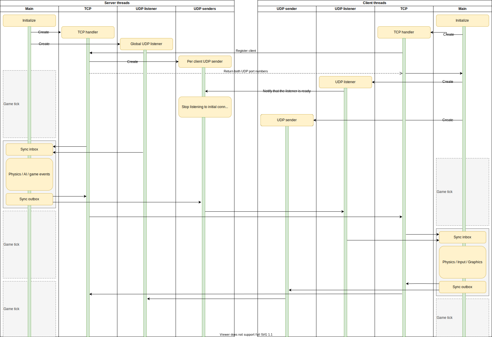

# Escape from Eros

## Project setup locally

Hopefully Intellij is smart enough to detect gradle files and offer to use .gradlew that's included in the repo
on the next startup, but just in case gradle can also be installed on your machine via
https://docs.gradle.org/current/userguide/installation.html

## Commit messages

Start your commit message with `#x` (where x is the issue number in gitlab) and then add a sentence 
describing the content of the commit. See https://www.freecodecamp.org/news/writing-good-commit-messages-a-practical-guide/
or a similar guide for to get the ideas what should be and shouldn't be covered in that message.
 
But P.S. - do keep the issue reference at the start of the message please, makes much more sense to have a fixed position
for that. 

## Network flow chart

